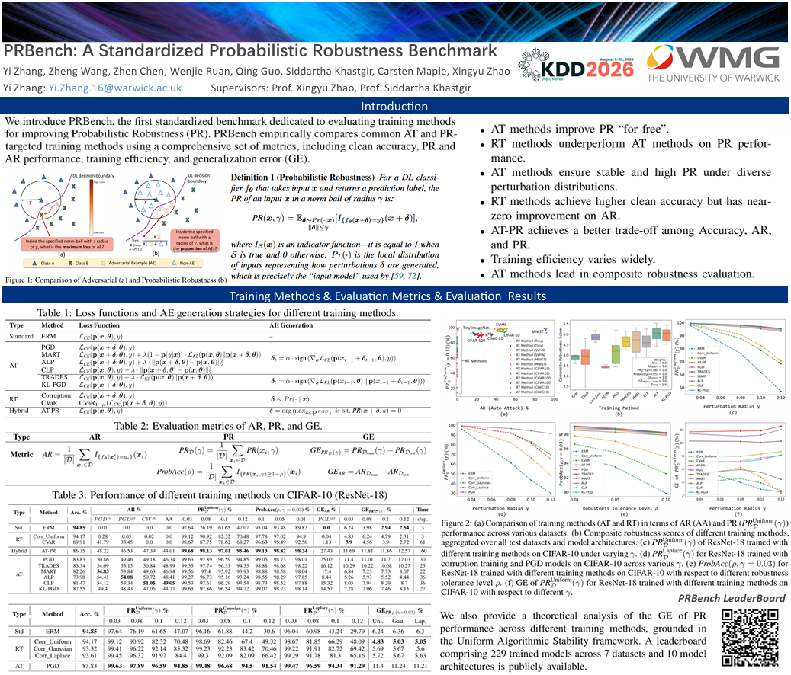
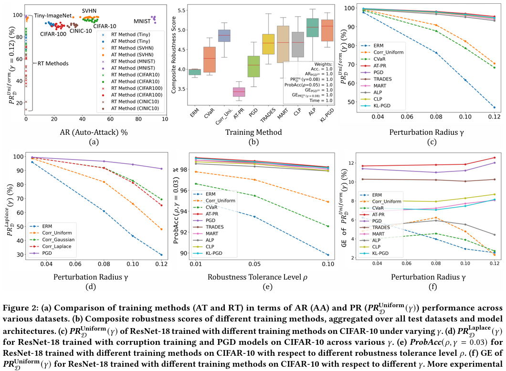

# PRBench: A Standardized Probabilistic Robustness Benchmark

[](https://wellzline.github.io/PRBenchLeaderboard/)
[](https://kdd2026.kdd.org/datasets-and-benchmarks-track-call-for-papers/#february_cycle)
[](LICENSE)

> [Yi Zhang](https://scholar.google.com/citations?user=9E8XJ54AAAAJ&hl=en), 
[Zheng Wang](https://scholar.google.com/citations?user=p0b4pLoAAAAJ&hl=en), 
[Zhen Chen](https://scholar.google.com/citations?user=Ezm8UAQAAAAJ&hl=en)
[Wenjie Ruan](https://scholar.google.com/citations?user=VTASFGEAAAAJ&hl=en),
[Qing Guo](https://scholar.google.com/citations?hl=en&user=Rj2x4QUAAAAJ)
[Siddartha Khastgir](https://scholar.google.com/citations?hl=en&user=r3ldU6sAAAAJ),
[Carsten Maple](https://scholar.google.com/citations?hl=en&user=8MMdv50AAAAJ)
[Xingyu Zhao*](https://scholar.google.com/citations?user=SzEBdA8AAAAJ&hl=en)
>
> *Corresponding Author

This repository provides the official implementation of **PRBench: A Standardized Probabilistic Robustness Benchmark**.

PRBench is a standardized benchmark for evaluating probabilistic robustness. It provides a unified evaluation protocol, benchmark datasets, and reproducible baselines to facilitate fair comparison across methods.


🌐 **Public Leaderboard:** [PRBench Leaderboard](https://wellzline.github.io/PRBenchLeaderboard/)

## 🔥 News

- [2026/05/16] Our work has been accepted by The KDD 2026 !


## 📌 Overview

<p align="center">
    
</p>

<p align="center">
    
</p>

## Abstract
Deep learning models are notoriously vulnerable to imperceptible perturbations. Most existing research focuses on adversarial robustness (AR), which evaluates robustness by determining whether a worst-case adversarial example (AE) exists. In contrast, probabilistic robustness (PR) measures the probability that predictions remain correct under stochastic perturbations. While PR is widely regarded as a practical complement to AR, dedicated training methods for improving PR are still relatively underexplored, albeit with emerging progress. Among the few PR-targeted training methods, we identify three limitations: i) non‑comparable evaluation protocols; ii) limited comparisons to adversarial training (AT) baselines despite anecdotal PR gains from AT, and; iii) no unified framework to compare the generalization of these methods. Thus, we introduce PRBench, the first benchmark dedicated to evaluating PR performance achieved by different robustness training methods. PRBench empirically compares most common AT and PR-targeted training methods using a comprehensive set of metrics, including clean accuracy, PR and AR performance, training efficiency, and generalization error (GE). We also provide theoretical analysis of the GE across different training methods, grounded in Uniform Algorithmic Stability. Our results reveal two distinct trade-off frontiers: AT methods improve both AR and PR performance at the cost of clean accuracy and GE, whereas PR-targeted methods prioritize high clean accuracy and PR with lower GE while trading off AR performance. Based on these observations, PRBench inspires future research: subsequent work may benefit from developing versatile, AT-based approaches that achieve balanced performance by jointly enhancing AR and PR while maintaining clean accuracy and low GE. These findings underscore the necessity of PRBench as the first standardized benchmark for PR, complementing the widely studied area of AR. 


## 🚀 Getting Started

### Installation

To install requirements:

```setup
pip install -r requirements.txt
```


### Training

To train the model(s) in the paper, run this command:

```train
bash run.sh

eg.
python main.py \
    --dataset CIFAR10 \
    --data_root ./dataset/cifar_10 \
    --model_name resnet18 \
    --input_size 32 \
    --model_depth 28 \
    --model_width 10 \
    --num_class 10 \
    --lr 0.1 \
    --batch_size 256 \
    --weight_decay 5e-4  \
    --epochs 100 \
    --save_path output/cifar10_res18/AT_Clean \
    --attack Clean \
    --attack_steps 10 \
    --attack_eps 8.0 \
    --attack_lr 2 \
    --phase train \
    --beta 6.0 
```

### Evaluation

To evaluate my model on ImageNet, run:

```eval
python main.py \
    --dataset CIFAR10 \
    --data_root ./dataset/cifar_10 \
    --model_name resnet18 \
    --input_size 32 \
    --model_depth 28 \
    --model_width 10 \
    --num_class 10 \
    --lr 0.1 \
    --batch_size 256 \
    --weight_decay 5e-4  \
    --epochs 100 \
    --save_path new_out/cifar10_res18/AT_Clean \
    --attack Clean \
    --attack_steps 10 \
    --attack_eps 8.0 \
    --attack_lr 2 \
    --phase eval \
    --beta 6.0 
```


## Citation
If you find this repo useful, please cite:
```
@article{zhang2026prbench,
  title={PRBench: A standardized probabilistic robustness benchmark},
  author={Zhang, Yi and Wang, Zheng and Chen, Zhen and Ruan, Wenjie and Guo, Qing and Khastgir, Siddartha and Maple, Carsten and Zhao, Xingyu},
  year={2026},
  booktitle={KDD'26: ACM SIGKDD Conf. on Knowledge Discovery and Data Mining},
  publisher={ACM}
}
```
